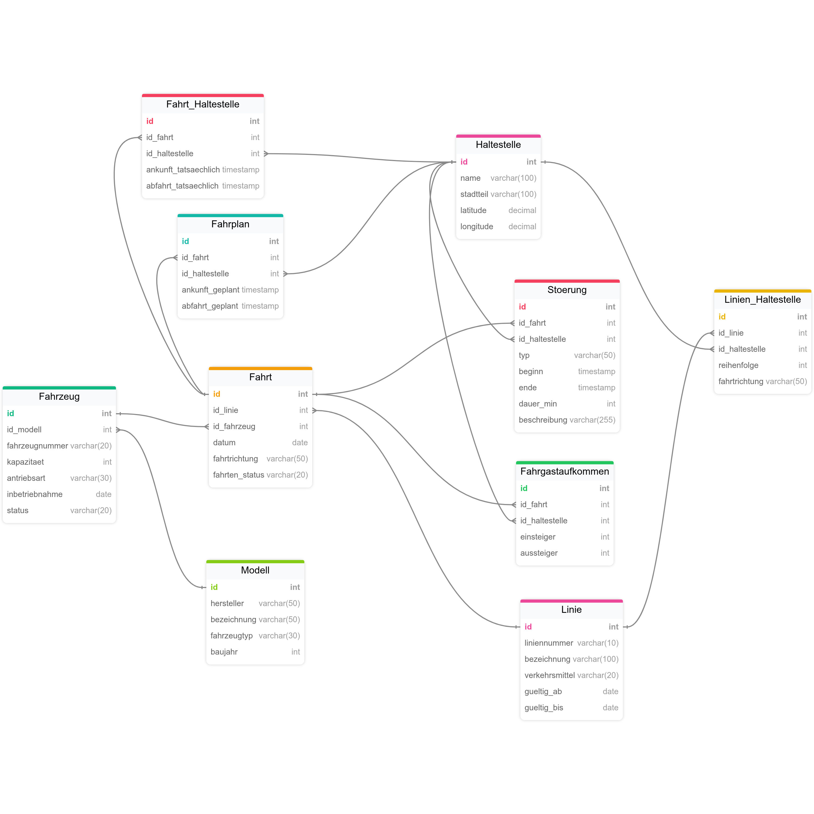
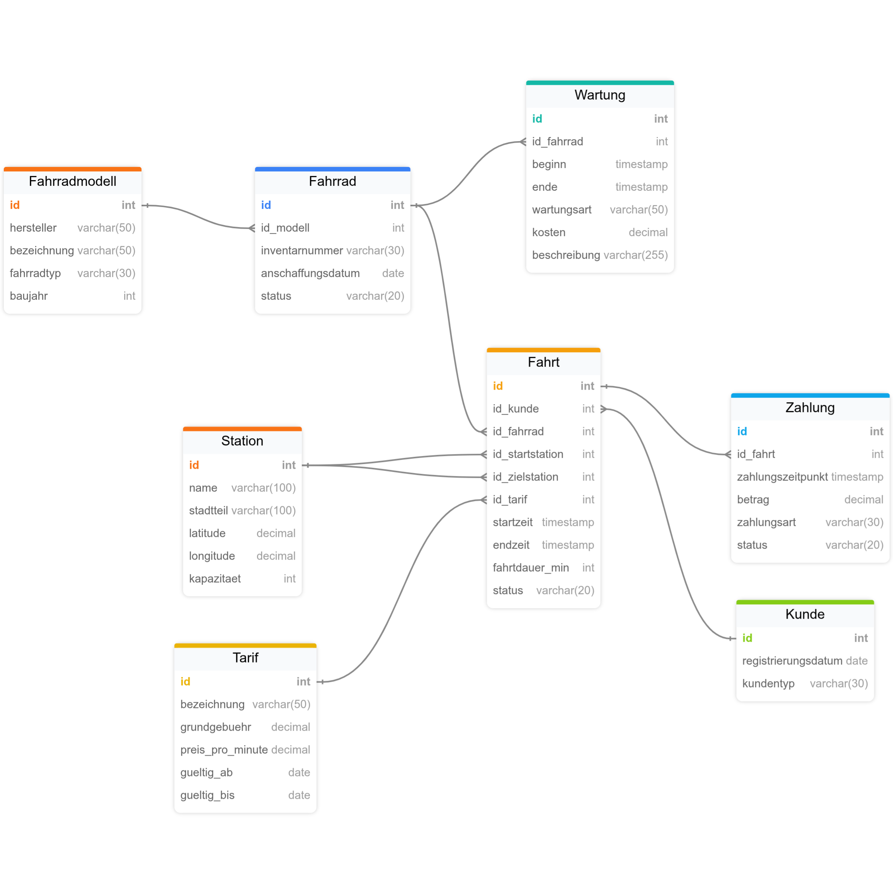
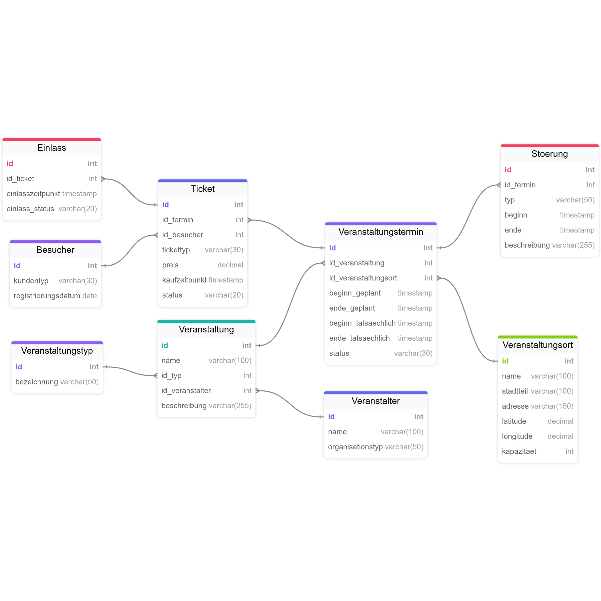
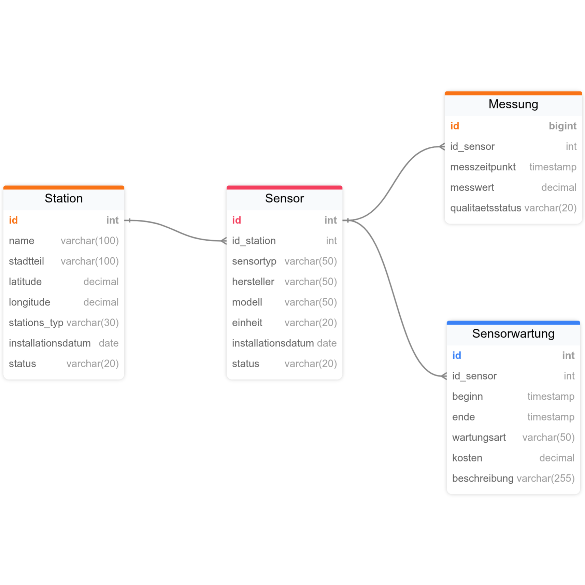

---
title: "Tutorial 1"
---

## Analysehintergrund und Szenario

Im Rahmen dieses Projekts soll ein Data Warehouse für eine fiktive Smart City entwickelt werden. Ziel ist es, Daten aus verschiedenen Bereichen des städtischen Lebens zusammenzuführen und für übergreifende Analysen bereitzustellen.

In einer modernen Stadt entstehen täglich große Mengen an Daten, die von unterschiedlichen operativen Systemen erfasst werden. Dazu gehören beispielsweise Daten des öffentlichen Personennahverkehrs, eines Fahrradverleihsystems, von Umwelt- und Wettersensoren sowie von Veranstaltungen. Diese Daten liegen zunächst getrennt voneinander in unterschiedlichen Quellsystemen vor und werden für die jeweiligen operativen Prozesse verwendet.

Für das geplante Szenario werden vier voneinander getrennte Quellsysteme betrachtet:

* **CityMove:** Verwaltung des öffentlichen Personennahverkehrs mit Linien, Haltestellen, Fahrzeugen, Fahrten, Fahrplänen und Fahrgastaufkommen.
* **BikeShare:** Verwaltung eines städtischen Fahrradverleihsystems mit Fahrrädern, Stationen, Kunden, Tarifen und Fahrten.
* **AirSense:** Sensorbasierte Erfassung von Wetter- und Umweltdaten, beispielsweise Temperatur, Niederschlag, Wind sowie verschiedenen Luftschadstoffen.
* **CityEvents:** Verwaltung von Veranstaltungen innerhalb der Stadt mit Veranstaltungsorten, Terminen, Tickets und Besucherzahlen.

Die einzelnen Quellsysteme erfüllen jeweils unterschiedliche Aufgaben und speichern ihre Daten in eigenen relationalen Datenbanken. Dadurch liegen Informationen, die für übergreifende Analysen relevant sind, zunächst voneinander getrennt vor.

Das Data Warehouse soll diese Daten aus den verschiedenen Quellsystemen integrieren und für analytische Zwecke aufbereiten. Dabei sollen gemeinsame Analyseperspektiven wie **Zeit** und **Ort** genutzt werden, um Zusammenhänge zwischen den verschiedenen Bereichen der Stadt untersuchen zu können.

Ein besonderer Fokus liegt auf der Verknüpfung von Mobilitäts-, Umwelt- und Veranstaltungsdaten. So soll beispielsweise untersucht werden können, wie sich Wetterbedingungen auf die Nutzung des Fahrradverleihsystems auswirken oder wie Veranstaltungen das Fahrgastaufkommen des öffentlichen Nahverkehrs beeinflussen. Ebenso können Zusammenhänge zwischen dem Mobilitätsaufkommen und der gemessenen Luftqualität untersucht werden.

Das Data Warehouse dient somit als zentrale analytische Datenbasis. Während die einzelnen Quellsysteme primär für operative Prozesse ausgelegt sind, ermöglicht das Data Warehouse eine systemübergreifende und historische Auswertung der Daten. Die Daten werden hierfür aus den Quellsystemen extrahiert, über ein Staging-Schema verarbeitet und anschließend in einem Core- und Business-Schema für Analysen und Reporting bereitgestellt.

Das übergeordnete Ziel des Projekts besteht darin, eine technische Grundlage zu schaffen, mit der verschiedene Entwicklungen innerhalb der Smart City anhand konsolidierter Daten analysiert werden können.

## Quellsysteme

### CityMove

- Modell(<u>id</u>, hersteller, bezeichnung, fahrzeugtyp, baujahr)
- Fahrzeuge(<u>id</u>, id_modell ↑)

{width="90%"}

### BikeShare

{width="90%"}

### CityEvents

{width="90%"}

### AirSense

{width="90%"}

## Fragestellungen für die Datenanalyse

Auf Basis der Daten aus den verschiedenen Quellsystemen sollen mithilfe des Data Warehouse unterschiedliche Fragestellungen im Bereich einer Smart City analysiert werden.

### Fragestellung 1 – Wetter und Fahrradnutzung

> Wie beeinflussen Wetterbedingungen die Nutzung des Fahrradverleihsystems?

Für diese Analyse werden Daten aus dem Quellsystem **BikeShare** mit den Wetter- und Umweltdaten aus **AirSense** kombiniert. Dabei können beispielsweise die Anzahl der Fahrradfahrten und die durchschnittliche Fahrtdauer in Abhängigkeit von Temperatur, Niederschlag oder Wind untersucht werden.

**Verwendete Quellsysteme:**
- BikeShare
- AirSense

**Mögliche Kennzahlen:**
- Anzahl der Fahrradfahrten
- durchschnittliche Fahrtdauer
- durchschnittliche Anzahl der Fahrten pro Station
- Temperatur
- Niederschlagsmenge

**Mögliche Analysedimensionen:**
- Zeit
- Ort
- Wetter

---

### Fragestellung 2 – Veranstaltungen und ÖPNV

> Wie verändert sich das Fahrgastaufkommen des öffentlichen Nahverkehrs während bzw. im  Umfeld von Veranstaltungen?

Hierfür werden die Daten aus **CityMove** und **CityEvents** miteinander verknüpft. Dadurch kann untersucht werden, ob und wie sich Veranstaltungen auf das Fahrgastaufkommen an nahegelegenen Haltestellen auswirken.

**Verwendete Quellsysteme:**
- CityMove
- CityEvents

**Mögliche Kennzahlen:**
- Anzahl der Einsteiger
- Anzahl der Aussteiger
- gesamtes Fahrgastaufkommen
- Verspätung in Minuten
- Anzahl der Besucher

**Mögliche Analysedimensionen:**
- Zeit
- Ort
- Linie
- Veranstaltung

---

### Fragestellung 3 – Veranstaltungen und Fahrradnutzung

> Wie beeinflussen Veranstaltungen die Nutzung von Fahrradverleihstationen in deren Umgebung?

Für diese Analyse werden Veranstaltungsdaten aus **CityEvents** mit den Fahrradfahrten aus **BikeShare** kombiniert. Dabei kann beispielsweise untersuch werden, ob sich die Anzahl der Fahrradfahrten während größerer Veranstaltungen verändert.

**Verwendete Quellsysteme:**
- CityEvents
- BikeShare

**Mögliche Kennzahlen:**
- Anzahl der Fahrradfahrten
- durchschnittliche Fahrtdauer
- Anzahl der Besucher
- Stationsauslastung

**Mögliche Analysedimensionen:**
- Zeit
- Ort
- Veranstaltung
- Fahrrad

---

### Fragestellung 4 – Wetter und ÖPNV

> Welchen Zusammenhang gibt es zwischen den Wetterbedingungen und dem Fahrgastaufkommen im öffentlichen Nahverkehr?

Dazu werden die Fahrgastdaten aus **CityMove** mit den Wetterdaten aus **AirSense** verbunden. Dadurch kann das Fahrgastaufkommen beispielsweise bei unterschiedlichen Temperaturen oder Niederschlagsmengen untersucht werden.

**Verwendete Quellsysteme:**
- CityMove
- AirSense

**Mögliche Kennzahlen:**
- Anzahl der Einsteiger
- Anzahl der Aussteiger
- gesamtes Fahrgastaufkommen
- durchschnittliche Verspätung
- Temperatur
- Niederschlagsmenge

**Mögliche Analysedimensionen:**
- Zeit
- Ort
- Wetter
- Linie

---

### Fragestellung 5 – Veranstaltungen und Verkehrsaufkommen

> Wie verändert sich das Mobilitätsaufkommen in einem Stadtgebiet bei Veranstaltungen unterschiedlicher Größe?

Für diese Fragestellung werden die Daten aus **CityEvents**, **CityMove** und **BikeShare** gemeinsam ausgewertet. Dadurch kann das Mobilitätsaufkommen rund um Veranstaltungsorte anhand verschiedener Verkehrsmittel betrachtet werden.

**Verwendete Quellsysteme:**
- CityEvents
- CityMove
- BikeShare

**Mögliche Kennzahlen:**
- Anzahl der ÖPNV-Fahrgäste
- Anzahl der Fahrradfahrten
- Anzahl der Besucher
- durchschnittliche Fahrtdauer
- Stationsauslastung

**Mögliche Analysedimensionen:**
- Zeit
- Ort
- Veranstaltung
- Linie
- Station

---

### Fragestellung 6 – Luftqualität und Mobilitätsaufkommen

> Gibt es einen Zusammenhang zwischen dem Mobilitätsaufkommen und der gemessenen Luftqualität in verschiedenen Stadtgebieten?

Hierfür werden die Mobilitätsdaten aus **CityMove** und **BikeShare** mit den Umweltmessungen aus **AirSense** kombiniert. Dadurch können beispielsweise Unterschiede der Luftqualität in Abhängigkeit vom Mobilitätsaufkommen und vom Stadtgebiet untersucht werden.

**Verwendete Quellsysteme:**
- AirSense
- CityMove
- BikeShare

**Mögliche Kennzahlen:**
- Anzahl der ÖPNV-Fahrten bzw. Fahrgäste
- Anzahl der Fahrradfahrten
- PM10-Konzentration
- PM2.5-Konzentration
- NO₂-Konzentration

**Mögliche Analysedimensionen:**
- Zeit
- Ort
- Verkehrsmittel