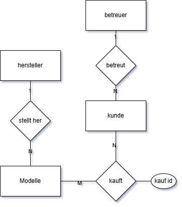

# Übung 1 – ER‑Modellierung

## 1. Erläuterung der Aufgabenstellung

- Ein Autohaus möchte eine Verkaufsdatenbank anlegen.  
  Erstellen Sie das dafür erforderliche Entity‑Relationship‑Modell (ERM).

- Verkauft werden zahlreiche Sportwagenmodelle verschiedener Hersteller.  
  Jedes Modell gehört genau **einem** Hersteller; jeder Hersteller bietet **mehrere** Modelle an.

- Die Kunden sind meist wohlhabende Autoliebhaber und kaufen im Laufe der Zeit **mehrere Modelle**, teilweise auch als Zweit‑ oder Drittwagen.

- Für die persönliche Betreuung ist jeweils **ein Kundenberater** verantwortlich, der seinerseits **mehrere Kunden** betreut.

---

## 2. Lösung – ER‑Diagramm

Meine Lösung:

---

## 3. Erklärung

### Identifizierte Entitäten

1. **Modell**  
   Repräsentiert Fahrzeugmodelle, nicht einzelne Autos.

2. **Hersteller**  
   Ein Hersteller bietet mehrere Modelle an → 1:n‑Beziehung.

3. **Kunde**  
   Ein Kunde kann mehrere Modelle kaufen → n:m‑Beziehung.

4. **Betreuer (Kundenberater)**  
   Ein Betreuer betreut mehrere Kunden → 1:n‑Beziehung.

### Beziehungen

- **Hersteller – Modell**  
  **1:n**  
  Ein Hersteller → viele Modelle  
  Ein Modell → genau ein Hersteller

- **Kunde – Modell**  
  **n:m**  
  Ein Kunde kann mehrere Modelle kaufen.  
  Ein Modell kann von vielen Kunden gekauft werden.  
  → benötigt eine eigene Beziehungstabelle (z. B. *Kauf*)

- **Betreuer – Kunde**  
  **1:n**  
  Ein Betreuer betreut mehrere Kunden.  
  Ein Kunde hat genau einen Betreuer.

---

## 4. Erklärung / Hinweise

Die Beziehung zwischen **Kunde** und **Modell** ist korrekt als **n:m** modelliert, da ein Kunde dasselbe Modell mehrfach kaufen kann (Zweitwagen, Drittwagen).

---

## 5. Ergebnis des Professors

Konnte leider nicht fotografiert werden.
