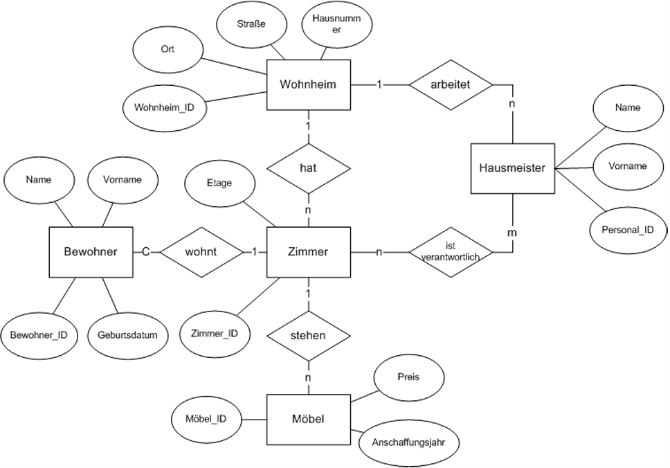

# Übung 2

## 1. Erläuterung der Aufgabenstellung

1. Identifizieren Sie die Primärschlüssel im dargestellten ER‑Modell.  
   Falls kein geeigneter Schlüsselkandidat vorhanden ist, definieren Sie einen Primärschlüssel.

2. Überführen Sie die Entitäten und Beziehungen in die Relationen­schreibweise.

3. Kennzeichnen Sie Primärschlüssel (PK) und Fremdschlüssel (FK).

---

## 2. Lösung – Identifizierte Entitäten und Schlüssel

### Entitäten

- **Wohnheim**  
  - Wohnheim_ID **PK**

- **Zimmer**  
  - Zimmer_ID **PK**  
  - Wohnheim_ID **FK**

- **Bewohner**  
  - Bewohner_ID **PK**  
  - Zimmer_ID **FK**

- **Möbel**  
  - Möbel_ID **PK**  
  - Zimmer_ID **FK**

- **Hausmeister**  
  - Personal_ID **PK**  
  - Wohnheim_ID **FK**

### Beziehungen

- **Wohnt** (Bewohner ↔ Zimmer)  
  - Bewohner_ID **PK, FK**  
  - Zimmer_ID **PK, FK**  
  → n:m‑Beziehung, daher eigene Relation

- **IstVerantwortlich** (Hausmeister ↔ Zimmer)  
  - Zimmer_ID **PK, FK**  
  - Personal_ID **PK, FK**  
  → ebenfalls n:m‑Beziehung

---

## 3. Lösung – Relationenmodell (Aufgabe 2 & 3)

- **Wohnheim**(Wohnheim_ID **PK**, Ort, …)

- **Hausmeister**(Personal_ID **PK**, Name, Wohnheim_ID **FK**, …)

- **Zimmer**(Zimmer_ID **PK**, Etage, Wohnheim_ID **FK**, …)

- **IstVerantwortlich**(Zimmer_ID **PK FK**, Personal_ID **PK FK**, …)

- **Möbel**(Möbel_ID **PK**, Zimmer_ID **FK**, Preis, Anschaffungsjahr, …)

- **Bewohner**(Bewohner_ID **PK**, Name, Zimmer_ID **FK**, …)

- **Wohnt**(Bewohner_ID **PK FK**, Zimmer_ID **PK FK**, …)

---

## 4. Erklärung / Hinweise

- Die Beziehung **„wohnt“** kann optional sein, falls ein Bewohner nicht zwingend ein Zimmer haben muss.  
  In diesem Fall wäre *Bewohner.Zimmer_ID* **NULL‑fähig**.

- Beide Beziehungen (**wohnt**, **ist verantwortlich**) sind korrekt als **eigene Relationen** modelliert, da es sich um **n:m‑Beziehungen** handelt.

